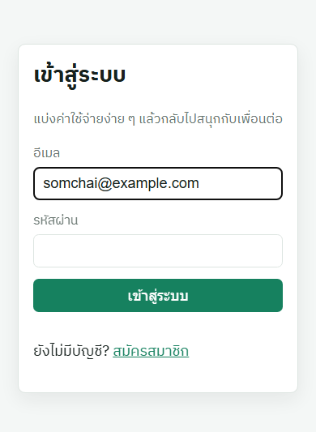
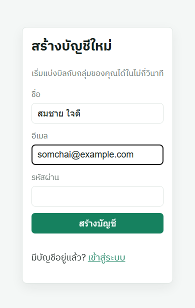
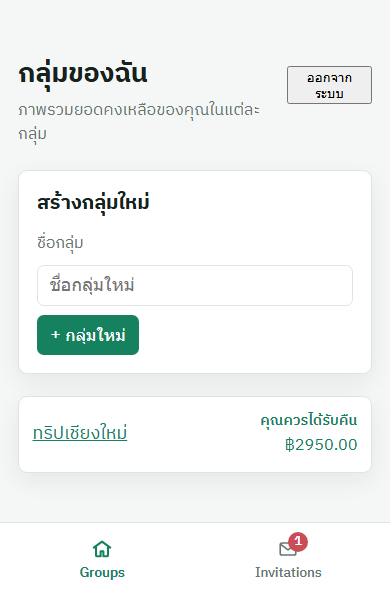
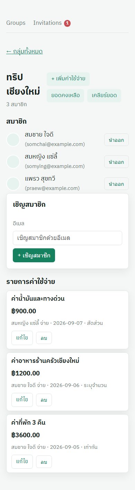
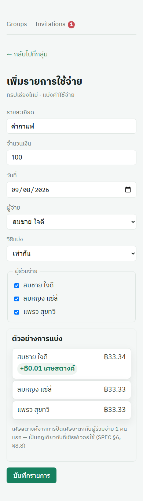
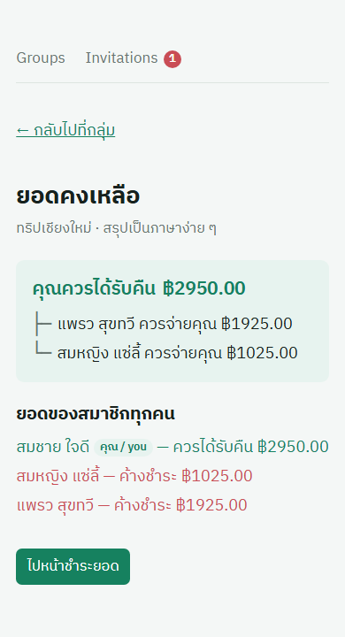
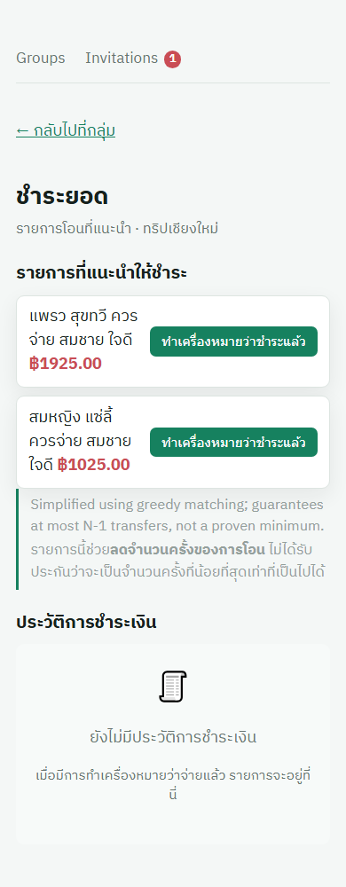

# Expense Splitting API

A group expense-sharing service, Splitwise-style: members record who paid for
what, and the API works out who owes whom down to the cent and proposes a short
list of repayments to settle up. It is a backend (FastAPI + PostgreSQL) plus a
React/TypeScript frontend.

I built this as the second project in my portfolio for backend / full-stack
internship applications, after an e-commerce API in Node/TypeScript. The goal
was to pick a domain where getting the money arithmetic wrong is obvious, and
then be careful about it.

[](https://github.com/putanetwanthanasak/expense-splitting-api/actions/workflows/ci.yml)

## Live demo

- **App (Vercel):** https://expense-splitting-api.vercel.app
- **API docs (Render, Swagger UI):** https://expense-splitting-api.onrender.com/docs

The backend is on Render's free tier, which spins down after a period of
inactivity. The first request after it has gone idle can take 30–50+ seconds
while the service wakes up; it is not broken, just cold. Subsequent requests are
fast.

The full specification is in [`docs/SPEC.md`](docs/SPEC.md); the invariants that
must always hold are summarized in [`CLAUDE.md`](CLAUDE.md).

## What it does

- Email/password auth with JWT bearer tokens.
- Groups with invite / accept / decline — an invited user is `PENDING` and has no
  access to the group until they accept.
- Expenses with four split types: `EQUAL`, `EXACT`, `PERCENTAGE`, `SHARES`.
- Live balance calculation per member, and a simplified settle-up transfer list.
- Settlements: records that a repayment happened offline. No real money moves.
- A frontend covering all eight screens, with a live split preview that matches
  the backend's rounding exactly.

## Stack

### Backend

| Choice | Why |
|---|---|
| Python 3.12+ | modern typing; used throughout for correctness rather than speed |
| FastAPI | type hints double as request validation and generate the OpenAPI docs |
| SQLAlchemy 2.0, sync | this project is about correctness, not throughput; async adds session/greenlet complexity this scale doesn't need |
| PostgreSQL | real `NUMERIC` and transaction support, both load-bearing for money math |
| Alembic | schema changes stay reviewable, ordered, and reversible |
| Pydantic v2 | validate once at the API boundary, trust the data everywhere past it |
| PyJWT + passlib[bcrypt] | stateless bearer tokens, standard password hashing |
| pytest + httpx + hypothesis | httpx drives the API like a real client; hypothesis property-tests the money math against thousands of random inputs |
| ruff + mypy | fast lint; mypy runs in strict mode |

### Frontend

| Choice | Why |
|---|---|
| React 19 + TypeScript | the screens in `docs/SPEC.md` §14; a dedicated `tsc` typecheck step in CI catches type errors that lint and `vite build` do not |
| Vite | fast dev server; `/api` is proxied to the backend so there's no CORS setup for local work |
| React Router 7 | client-side routing between the screens |
| Plain CSS + custom-property design tokens | no CSS framework; tokens keep spacing/colour consistent across the redesign without a build-time dependency |
| Vitest + Testing Library | same test style as the backend — drive the UI like a user, assert on what's on screen |
| oxlint | lint; a CI step also greps `src/` to enforce the money-helper boundary (below) |

## Technical highlights

### Splitting money without losing a cent

`100 / 3 = 33.333...`. Round every share to `33.33` and three of them sum to
`99.99` — a cent has vanished, and the group's balances stop summing to zero.

The fix is the largest remainder method: round every share *down* to the cent,
then hand out the leftover cents one at a time, in a fixed order, until the
shares sum back to the original total exactly.

```python
# app/services/splitting.py — _distribute_largest_remainder
shares = {uid: ideal_shares[uid].quantize(CENT, rounding=ROUND_DOWN) for uid in order}

remainder = total - sum(shares.values(), start=Decimal("0.00"))
extra_cents = int(remainder / CENT)

for i in range(extra_cents):
    shares[order[i]] += CENT

assert sum(shares.values(), start=Decimal("0.00")) == total
```

`split_equally`, `split_exact`, `split_by_percentage`, and `split_by_shares` all
validate their own inputs and then call this same helper. Splitting `100.00`
three ways gives `33.34, 33.33, 33.33`. `splitting.py` is a pure module — it may
not import SQLAlchemy or FastAPI — so the same logic is property-tested against
thousands of random totals in `tests/test_split_calculation.py`, and it is
asserted against real data in `app/services/expenses.py` before any transaction
commits. The frontend ports the identical algorithm in `frontend/src/lib/split.ts`
so the pre-submit preview never disagrees with what the backend saves.

### Debt simplification

Settling every pairwise debt directly produces more transfers than necessary — a
three-person cycle where everyone owes the next person 100 nets out to zero
transfers, not three. `app/services/simplify.py` reduces a group's net balances
to a short transfer list with a greedy algorithm: repeatedly match the largest
creditor against the largest debtor (two max-heaps via `heapq`), transfer as much
as satisfies the smaller side, and repeat.

- **Complexity:** O(n log n).
- **Transfer count:** at most N−1 for N members with a nonzero balance — each step
  fully settles at least one side and removes it from its heap.
- **What it does not do:** produce the fewest possible transfers. That is a
  different, much harder problem — it requires finding subsets of balances that
  sum to zero so they can settle among themselves, which reduces from
  subset-sum / partition and is NP-hard. This repo implements the greedy version
  and says so plainly wherever the result is shown, including in the API response
  itself, rather than overstating what it computed.

### The invariant that catches almost everything

The core correctness property of the whole system: **a group's net balances
always sum to exactly zero.** If they don't, money was created or destroyed
somewhere.

Rather than trust every test author to remember to check this, `tests/conftest.py`
has an `autouse=True` fixture that runs after *every single test in the suite* —
so after every balance-changing operation any test performs — walks every group
in the database, and asserts `sum(net_balance) == Decimal("0.00")` for each one.
That turns the entire test suite into a fleet of invariant checks for free: a
rounding or split-calculation mistake fails a test as soon as any test exercises
the affected path, instead of surviving as a balance that quietly doesn't add up.

### Frontend: money as integer cents, and 401 vs 403

**Money is never a float on the frontend either.** The backend serializes
`Decimal` as a JSON *string* (`"33.34"`, not `33.34`). `frontend/src/lib/money.ts`
is the only place money is parsed, added, or formatted: internally an amount is a
whole number of **cents**, and all arithmetic is integer arithmetic. `Number()`
and `parseFloat()` appear nowhere else under `src/` — parsing a money string with
either reintroduces binary floating point — and a CI step greps the tree to keep
it that way.

**401 and 403 are handled by separate branches** in the single fetch wrapper
(`frontend/src/lib/api.ts`):

- **401** (not authenticated — missing or expired token): clear the token and
  redirect to `/login`.
- **403** (authenticated but not a member of this group): surface an error and
  **stay logged in** — never log the user out.

`/api/auth/login` and `/api/auth/register` opt out of the 401 branch, because a
wrong password legitimately returns 401 and the login form needs to show it
rather than the app bouncing back to `/login` in a loop.

## Design decisions

### There is deliberately no `balances` table

Balances are recomputed from expenses and settlements on every read. There is no
stored `balances` table and no cached balance column anywhere.

A stored balance is a race condition waiting to happen: two concurrent expense
inserts both read the same starting balance, both compute a new total, and both
write it back — one write silently overwrites the other, and nobody finds out.
Live computation has no stored state to corrupt in the first place. It is slower
at scale, and for a project of this size that trade is the right one. If caching
ever became necessary the answer would be a materialized view or a guarded write
with a version column — never a naive `UPDATE ... SET amount = amount + ?`.

### Sync SQLAlchemy, not async

FastAPI runs sync endpoints in a threadpool automatically, so a sync database
layer does not block the event loop. Async SQLAlchemy would add session-management
and greenlet complexity, and at this scale there is no throughput problem for it
to solve. Going async would be a deliberate decision with its own justification,
not something to adopt just because FastAPI is often used that way.

## Example: the settle-up endpoint

`GET /api/groups/{id}/settle-up` returns the reduced repayment list for a group
(numbers below are the worked example from `docs/SPEC.md` §7):

```
GET /api/groups/{id}/settle-up
Authorization: Bearer <token>
```

```json
{
  "transfers": [
    { "from_user_id": "uuid2", "to_user_id": "uuid1", "amount": "100.00" },
    { "from_user_id": "uuid3", "to_user_id": "uuid1", "amount": "50.00" }
  ],
  "note": "Simplified using greedy matching; guarantees at most N-1 transfers, not a proven minimum."
}
```

The `note` is returned by the API verbatim so a client shows it rather than
writing its own, possibly overstated, description of the list.

## Running it

Requires Python 3.12+, [`uv`](https://docs.astral.sh/uv/), Node 22+, and a local
PostgreSQL server.

### Backend

```bash
uv sync --locked
cp .env.example .env                                    # then fill in real values
createdb expense_splitting && createdb expense_splitting_test
uv run alembic upgrade head
uv run uvicorn app.main:app --reload
```

The API is then at `http://localhost:8000`, with interactive docs at
`http://localhost:8000/docs`. Run the tests with `uv run pytest`; they use
`TEST_DATABASE_URL` and the suite refuses to start if that database's name does
not contain `test`.

### Frontend

```bash
cd frontend
npm install
npm run dev        # http://localhost:5173, proxies /api -> :8000
```

Run the backend as well so the `/api` proxy has something to talk to. Frontend
tests: `npm test`.

## Screenshots

The frontend is Thai-language and mobile-first. These are captured from the
running app at a 390px viewport, light mode, against throwaway demo data.

**Login** — email + password on the app's canvas background



**Register** — name, email and password, one green call to action



**Groups** — each row carries the viewer's own live net balance; the bottom nav badges the pending-invite count



**Group detail** — members first, then the expense feed with each entry tagged by its split type



**Add expense** — mid-fill: a ฿100 equal split, live preview showing ฿33.34 / ฿33.33 / ฿33.33 and the +฿0.01 remainder tag



**Invitations** — a pending group invite with accept / decline actions


**Balance summary** — a highlighted "your standing" card over a per-member owed / owing breakdown, the current user badged



**Settle up** — the reduced transfer list (two transfers into one member here), the greedy-matching disclaimer returned verbatim by the API, and an empty settlement history



## Project layout

```
app/
  main.py           FastAPI app + route registration
  config.py         pydantic-settings, loads .env
  database.py       SQLAlchemy engine + SessionLocal (sync)
  models/           ORM models, one file per entity
  schemas/          Pydantic v2 request/response schemas
  services/         business logic (splitting, balances, debt simplification, auth)
  routers/          FastAPI routers
tests/
  conftest.py       test-database fixtures, per-test rollback, the §8.1 autouse check
alembic/            migrations
frontend/
  src/lib/          money.ts, split.ts, api.ts and other shared helpers
  src/pages/        one component per screen
docs/SPEC.md        the authoritative specification
```
